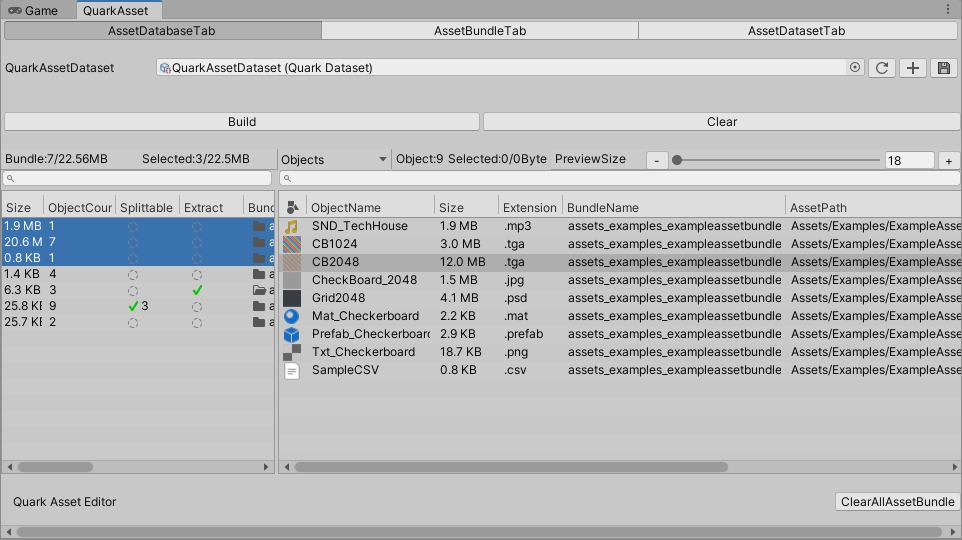
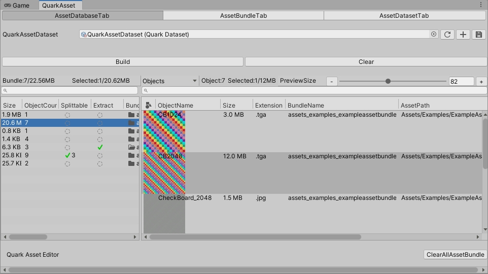

[](LICENSE)
[](https://github.com/DonnYep/QuarkAsset/wiki)

# QuarkAsset

QuarkAsset是一套轻量级的插件化Unity资源加载方案。 内置AssetDatabae与AssetBundle加载模式。加载模式皆支持引用计数，可实时查看资源信息。快速开发阶段可采用AssetDatabase模式，无需进行ab构建。调试阶段可采用AssetBundle模式，轻松构建ab资源。在构建ab时，支持对资源的加密。在Runtime加载资源时，可通过对应的密钥对资源进行解密。支持编辑内对包体分割，有效控制颗粒度。支持查看ab的依赖关系。内置BuildPipeline，可通过命令行实现自动化资源构建。支持构建预设，可版本控制构建profile预设。Jenkins自动化部署测试已通过。

-----

<a name="标题导航"></a>

# 标题导航
- [QuarkAsset](#quarkasset)
- [标题导航](#标题导航)
  - [UPM支持](#upm支持)
  - [QuarkEditor编辑器](#quarkeditor编辑器)
    - [AssetDatabaseTab](#assetdatabasetab)
      - [设置AssetBundle](#设置assetbundle)
      - [查看AssetBundle中的资源](#查看assetbundle中的资源)
      - [查看AssetBundle依赖](#查看assetbundle依赖)
      - [拆分AssetBundle](#拆分assetbundle)
    - [AssetBundleTab](#assetbundletab)
    - [AssetDatasetTab](#assetdatasettab)
  - [QuarkRuntime入口-QuarkConfig](#quarkruntime入口-quarkconfig)
    - [未选择加载模式](#未选择加载模式)
    - [AssetDatabase加载模式](#assetdatabase加载模式)
    - [AssetBundle加载模式](#assetbundle加载模式)
  - [QuarkRuntime加载&卸载](#quarkruntime加载&卸载)
  - [QuarkRuntime应用实例](#quarkruntime应用实例)
    - [自定义入口实例](#自定义入口实例)
    - [QuarkResources加载](#quarkresources加载)
      - [QuarkResources同步加载](#quarkresources同步加载)
      - [QuarkResources异步加载](#quarkresources异步加载)
    - [QuarkResources卸载](#quarkResources卸载)
      - [QuarkResources卸载单个资源](#quarkResources卸载单个资源)
      - [QuarkResources卸载assetbundle](#quarkResources卸载assetbundle)
  - [BuildPipeline](#buildpipeline)
    - [打包配置](#打包配置)
    - [命令行打包](#命令行打包)
  - [差量更新](#差量更新)
    - [文件清单合并](#文件清单合并)
  - [注意事项](#注意事项)


<a name="UPM支持"></a>

## UPM支持

* QuarkAsset是完全插件化的unity库，文件夹结构遵循unityPackage规范。

* UPM本地导入。选择Assets/QuarkAsset文件夹，拷贝到工程目录的Packages目录下，完成导入。

* UPM从git导入。url链接: https://github.com/DonnYep/QuarkAsset.git#upm 

<a name="QuarkEditor编辑器"></a>

## QuarkEditor编辑器

* Quark编辑器打开路径为`Window>QuarkAsset>QuarkAssetEdior`。

* 为实现团队协作，且灵活配置资源，Quark采用了`scriptableObject`作为资源寻址配置。

* 配置文件可在Quark的编辑器最上方，点击`CreateDataset`生成。

* 为方便阐述，下文统一采用`dataset`称呼Quark的资源寻址配置。

* Quark编辑器一共含三个选项卡，分别为:`AssetDatabaseTab`、`AssetBundleTab`与`AssetDatasetTab`。

* `AssetDatabaseTab`用于为`dataset`设置assetbundle与生成资源寻址信息.

* `AssetBundleTab`用于为`dataset`生成assetbundle资源与相关处理。

* `AssetDatasetTab`用于为`dataset`设置可识别的文件后缀名。

<a name="QuarkEditor-AssetDatabaseTab"></a>

### AssetDatabaseTab


* 此页面显示dataset中包含的AssetBundle信息。

* 每一条bundle信息都可通过点击右键生成的菜单进行操作。

* 每一条object信息都可通过点击右键生成的菜单进行操作。

<a name="设置AssetBundle"></a>

#### 设置AssetBundle

* 将需要被打包为ab的文件夹或资源拖拽入bundle label窗口，被拖入的资源会自动生成ab名称。点击上方Build按钮，完成dataset资源识别。
  
<a name="查看AssetBundle中的资源"></a>

#### 查看AssetBundle中的资源


* 选中需要查看的bundle，在右侧label中可缩放查看缩略图信息。

<a name="查看AssetBundle依赖"></a>

#### 查看AssetBundle依赖


* 如图所示，选择显示区类别，可查看bundle的依赖关系以及subbundle信息。

<a name="拆分AssetBundle"></a>

#### 拆分AssetBundle


* 选择bundle，点击右键显示菜单，点击"Mark as splittable"选项，被选中的bundle会被标记为可分割的bundle，点击"Build"按钮，刷新信息。
  
* 分割bundle的逻辑为，若bundle存在子文件夹，则第一级的子文件夹被标记为新的bundle，在构建bundle时会生成新的bundle，同时父级bundle则不会再构建。


<a name="QuarkEditor-AssetBundleTab"></a>

### AssetBundleTab


* 此Tab用于ab打包操作。

* 打包ab时需要选择ab所对应的平台。若需要拷贝到streamingAssets文件夹，则勾选CopyToStreamingAssets选项。

* 其余可选择使用默认预设。


<a name="QuarkEditor-AssetDatasetTab"></a>

### AssetDatasetTab


* Dataset通过文件后缀名进行识别。 此列表表示所有可以被quark识别的文件后缀名类型。若自定义的后缀名未被quark识别，则在此页面增加需要被识别的后缀名。

-----

<a name="QuarkRuntime入口"></a>

## QuarkRuntime入口-QuarkConfig

* 选择合适初始化入口，挂载`QuarkConfig`脚本。

<a name="QuarkConfig未选择加载模式"></a>

### 未选择加载模式


<a name="QuarkConfig-AssetDatabase加载模式"></a>

### AssetDatabase加载模式


* 为`QuarkAssetDataset`赋予build好的dataset，即完成配置。

<a name="QuarkConfig-AssetBundle加载模式"></a>

### AssetBundle加载模式


* AssetBundle模式下默认采用StreamingAssets路径加载。

* 若build后的ab文件处于StreamingAssets目录下的其他路径，勾选`EnableRelativeBuildPath`选项。勾选`EnableRelativeBuildPath`表示为采用`StreamingAssets`目录下的相对路径进行加载，需要在`RelativeBuildPath`中填入相对路径的地址。

* 若在资源构建阶段进行了加密，则在Encryption折叠选项下填入对应的密钥与数字，Quark会在runtime自动解密。

* QuarkRuntime加载资源会自动计算引用计数，并根据引用计数加载或卸载assetbundle，无需手动管理ab资源。

-----

<a name="QuarkRuntime加载&卸载"></a>

## QuarkRuntime加载&卸载

* Quark的加载&卸载类为`QuarkResources`。

* 加载资源时输入的名称可采用以下三种范式：
    * 1、资源名。      
    * 2、资源名.后缀   
    * 3、资源路径      

* 加载&卸载时请注意以下内容：
    * 1、资源名大小写敏感的资源名 。示例：MyAudio
    * 2、后缀名大小写不敏感。示例：MyAudio.mp3或MyAudio.MP3
    * 3、资源路径大小写敏感，地址须以Assets/开头。示例：Assets/Audio/MyAudio.mp3。采用地址加载时，后缀名需要小写。
    
-----

<a name="QuarkRuntime应用实例"></a>

## QuarkRuntime应用实例

<a name="自定义入口实例"></a>

### 自定义入口实例

```csharp
using Quark;
using UnityEngine;
[DefaultExecutionOrder(-2000)]//建议延后入口执行优先级
public class GameLauncher : MonoBehaviour
{
    private void Awake()
    {
        QuarkResources.OnCompareManifestSuccess += OnCompareManifestSuccess;
        QuarkResources.OnCompareManifestFailure += OnCompareManifestFailure; 
    }
    private void Start()
    {
        if (QuarkResources.QuarkAssetLoadMode == QuarkLoadMode.AssetDatabase)
        {
            InitGame();
        }
    }
    private void OnCompareManifestSuccess(long size)
    {
        if (QuarkResources.QuarkAssetLoadMode == QuarkLoadMode.AssetBundle)
        {
            InitGame();
        }
    }
    private void OnCompareManifestFailure(string message)
    {
       //这里表示文件清单未被读取到，需要检查build后的文件是否存在以及路径是否正确
    }
    void InitGame()
    {
        //Quark资源初始化成功，可进行初始化！
    }
}
```

<a name="QuarkResources加载"></a>

### QuarkResources加载

<a name="QuarkResources同步加载"></a>

#### QuarkResources同步加载

```csharp
var myAudio = QuarkResources.LoadAsset<AudioClip>("MyAudio");// 资源名加载
var myText = QuarkResources.LoadAsset<TextAsset>("MyText.json");//资源名.后缀名加载
var myTexture = QuarkResources.LoadAsset<Texture>("Assets/Textures/MyTexture.png");//完整路径加载。注意路径需要采用 / ，\\不支持！
```

<a name="QuarkResources异步加载"></a>

#### QuarkResources异步加载

```csharp
QuarkResources.LoadAssetAsync<AudioClip>("MyAudio",res=> 
    //加载完成回调，获取资源, do sth
});
QuarkResources.LoadAssetAsync<TextAsset>("MyText.json",res=> 
{
    //加载完成回调，获取资源, do sth
});
QuarkResources.LoadAssetAsync<Texture>("Assets/Textures/MyTexture.png",res=> 
{
    //加载完成回调，获取资源, do sth
});
//异步加载场景
QuarkResources.LoadSceneAsync("MyScene",progress=>{Debug.Log(progress);},()=>{Debug.Log("Load Done");},false);
```

<a name="QuarkResources卸载"></a>

### QuarkResources卸载

<a name="QuarkResources资源单个卸载"></a>

#### QuarkResources卸载单个资源

* 卸载与加载相同，都支持三种三种范式：
    * 1、资源名。      
    * 2、资源名.后缀   
    * 3、资源路径      

```csharp
//资源名卸载单个资源
QuarkResources.UnloadAsset("MyAudio"); 
//资源名.后缀卸载单个资源
QuarkResources.UnloadAsset("MyText.json"); 
//资源路径卸载单个资源
QuarkResources.UnloadAsset("Assets/Textures/MyTexture.png"); 
//卸载场景
QuarkResources.UnloadSceneAsync("MyScene",progress=>{Debug.Log(progress);},()=>{Debug.Log("Unload Done")); 
```

<a name="QuarkResources卸载assetbundle"></a>

#### QuarkResources卸载assetbundle

```csharp
//卸载assetbundle
QuarkResources.UnloadAssetBundle("MyBundle",true); 
```

-----
<a name="BuildPipeline"></a>

## BuildPipeline

* Quark支持自动化流水线，提供构建静态函数，目前测试可使用Jenkins进行自动化部署。

<a name="打包配置"></a>

### 打包配置

* 选择一个项目中使用的QuarkAssetDataset类型文件，将文件名更改为QuarkAssetDataset后，放到Assets根目录下。放置完毕后路径应与如下相同。
```
Assets/QuarkAssetDataset.asset
```
<a name="命令行打包"></a>

### 命令行打包

* 命令行可调用的API如下：

```csharp
//对当前活跃平台的资源进行打包
QuarkBuildPipeline.BuildActivePlatformAssetBundle();
//打包指定平台的资源
QuarkBuildPipeline.BuildAssetBundle(BuildTarget buildTarget);
```

<a name="差量更新"></a>

## 差量更新

* Quark支持母包内嵌加热更下载。

* 目前支持StreamingAssets与persistentdatapath地址的同时加载。

<a name="文件清单合并"></a>

### 文件清单合并

* 使用如下API，对不同的文件清单进行合并，获得合并的文件清单后即可使用不同路径下的ab资源。
```csharp
QuarkUtility.Manifest.MergeManifest(srcManifest,diffManifest,out var mergedManifest);
```


<a name="注意事项"></a>

## 注意事项

* 若在编辑器环境下对AB进行构建，为使得构建的资源准确无误，建议每次都手动清理StreamingAssets下的文件夹。

* 自动化部署构建资源请根据打包策略选择合适的清理方式。建议采用所有资源重新构建的策略。

**[回到最上层](#标题导航)**
